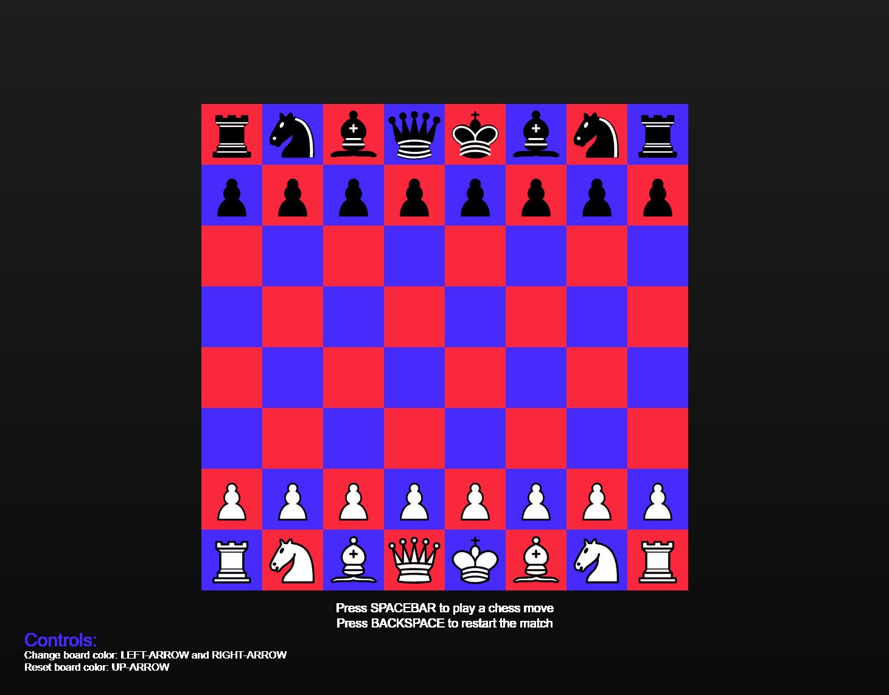

# Generative Chessbord
* **Naam:** `Mike Hovenier`
* **Minor:** `Visual Interface Design`
* **Startniveau:** `Rood (iets verder dan beginner)`

## Concept

Mijn nieuwe hobby in de covid-19 is online en fysiek schaken, klinkt heel suf, maar schaken is zo veel interessanter dan gedacht. Het is een tactisch oud bordspel waarbij je op creatieve manieren je tegenstander kunt schaakmat zetten. Ik wil daarom een generative-art schaakbord maken, hierbij kun je willekeurige setten zetten tegen het bord zelf. Door te klikken op bepaalde knoppen op het toetsenbord kun je interacteren met het bord. Na een bepaald aantal setten lijken dit mischien op krassen door een schaakbord, maar is eigenlijk heel interessant hoe een beëindigd spel er uit eindelijk uit kan zien. Elk potje schaken is natuurlijk anders, dus zo zal het patroon ook elke keer anders zijn. *"De kunst van schaken"*.

Om realistisch te blijven, is schaken natuurlijk wel erg complex en zijn er best veel regels. Om dit allemaal volgens de regels te maken zal heel lastig zijn en heel veel tijd kosten. Met die reden zal ik daarom niet het hele schaaksysteem na kunnen maken, maar wel zo ver mogelijk binnen de regels proberen te vallen. Schaaksetten zullen soms dus helemaal niet kunnen of helemaal niet goed zijn, maar het gaat om het idee dat de kunst van schaken er zo uit kan zien.

## Features

In het schaakbord zitten er verschillende soorten features, met deze feature kun je interacteren met het schaakbord.
* **Lijnen maken:** Om een willekeurige lijn neer te zetten, kun je op de _SPATIEBALK_ kliken, het schaakbord speelt vervolgens na een halve seconde tegen jou een zet. Om alle willekeurige lijnen weer weg te halen kun je op de _BACKSPACE_ knop klikken. Alle gezetten lijnen worden vervolgens van het bord verwijderd.
* **Bord kleuren veranderen:** Als je je schaakbord kleuren wilt aanpassen kun je hiervoor de _LINKER PIJL_ en _RECHTER PIJL_ gebruiken. Hierdoor veranderen de twee kleuren van het bord. Om dit weer terug te zetten naar de originele rode en blauwe kleur, klik dan op het _PIJL NAAR ONDER_.
* **Checkmate:** Bij een checkmate is het spel beëindigd en kun je niet meer verder spelen, door weer op _BACKSPACE_ te klikken kun je weer een nieuw spel starten.

## Links naar prototype

_Link to project: https://editor.p5js.org/mikehov/sketches/4Rv33lRH51_

*Link to project: https://mikehov.github.io/Generative-art/basic_website*

## Proces

Om het volledige proces te bekijken van het "Generative Chessbord", klik dan op Basic_website/proces.md